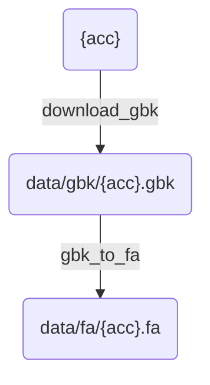
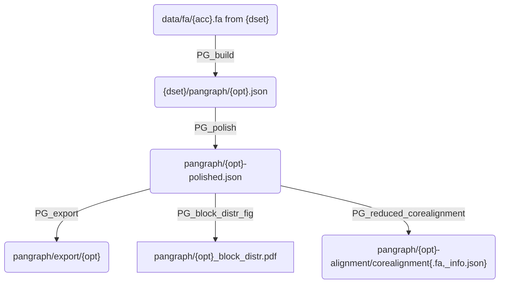

# Workflow description

## download.smk

Contains rules for downloading data given an accession number `{acc}`.

## pangraph.smk

Rules to build, polish and export a pangenome graph given a `{dset}` (collection of accession numbers) and a kernel option `{opt}`. Results are saved either in the `figs/{dset}` or `results/{dset}` subfolders

**Description**:
- `pangraph/export/{opt}` : folder containing `.gfa` export of the polished pangraph.
- `pangraph/{opt}_block_distr.pdf` : figure with distribution of block frequency/length.
- `pangraph/{opt}-alignment/corealignment` : reduced core alignment, and info file with number of sites having gaps / being consensus.