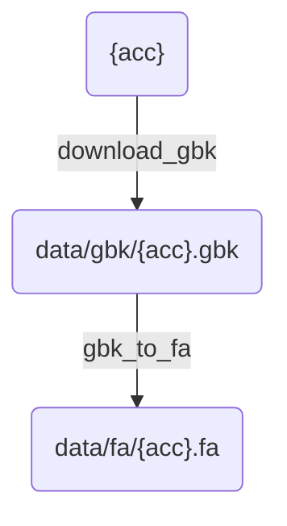
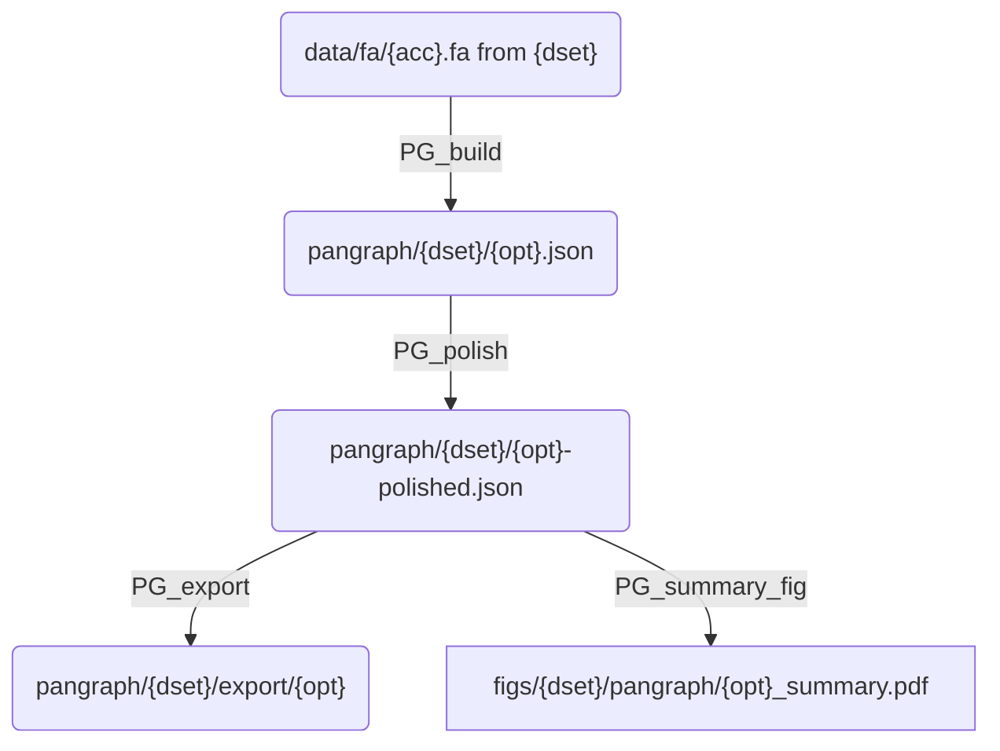

# Workflow description

## download.smk

Contains rules for downloading data given an accession number `{acc}`.

## pangraph.smk

Rules to build, polish and export a pangenome graph given a `{dset}` (collection of accession numbers) and a kernel option `{opt}`.

**Description**:
- `pangraph/{dset}/export/{opt}` : folder containing `.gfa` export of the polished pangraph.
- `figs/{dset}/pangraph/{opt}_summary.pdf` : summary figure with distribution of block frequency/length.
