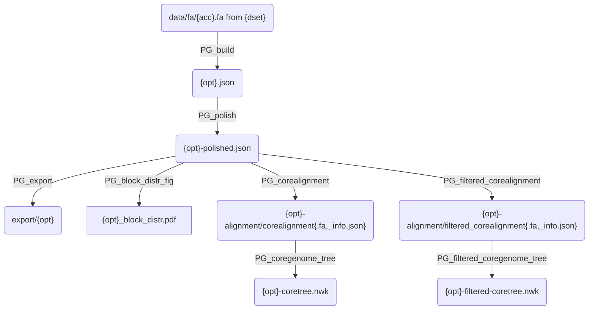
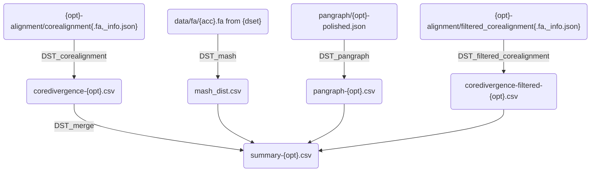

# Workflow description

## download.smk

Contains rules for downloading data given an accession number `{acc}`.

## pangraph.smk

Rules to build, polish and export a pangenome graph given a `{dset}` (collection of accession numbers) and a kernel option `{opt}`. Results are saved either in the `figs/{dset}/pangraph` or `results/{dset}/pangraph` subfolders, depending on their type.

**Description**:
- `export/{opt}` : folder containing `.gfa` export of the polished pangraph.
- `{opt}_block_distr.pdf` : figure with distribution of block frequency/length.
- `{opt}-alignment/corealignment{.fa,_info.json}` : reduced core alignment, and info file with number of sites having gaps / being consensus.
- `{opt}-coretree.nwk` : core genome tree build from the reduced alignment (rescaled with information on the number of consensus vs mutated sites).
- `filtered` core-alignment and core-tree are different only in one respect: the alignment has been filtered for regions with high SNPs densitive, which are indicative of recombination.

## distances.smk

Rules to estimate evolutionary distances between strains. Results are saved in `results/{dset}/distances`.

**Description**
- `coredivergence-{opt}.csv` : core genome divergence, evaluated from the restricted core genome alignment, and rescaled with alignment info to the full core genome.
- `coredivergence-filtered-{opt}.csv` : same but constructed from the recombination-filtered alignment.
- `mash_dist.csv` : mash distance.
- `pangraph-{opt}.csv` : pangenome graph distances, including:
  - length of private / shared sequence in the pair (total = 2 genomes)
  - total number of blocks in the projection / n. breakpoints
  - partition entropy
- `summary-{opt}.csv` : summary dataframe containing all distances