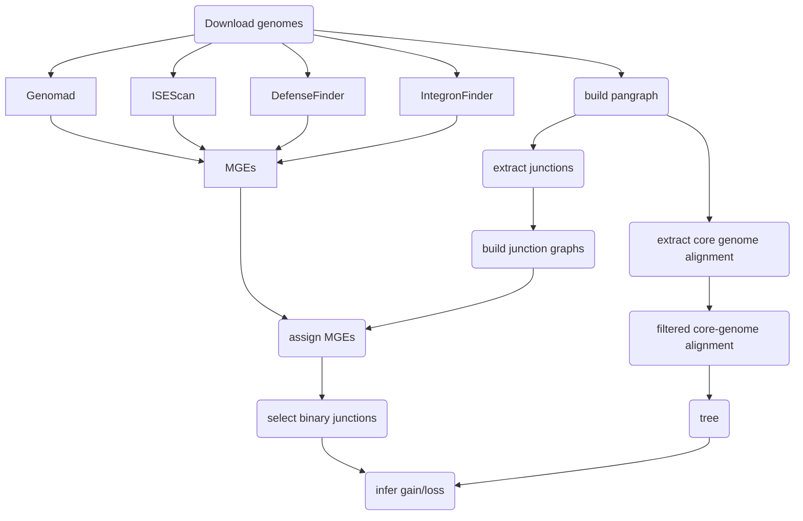

# pipeline overview

Below is a rough overview of what the main part of the pipeline does:

- Genomes are downloaded from NCBI
- Mobile Genetic Elements (MGEs) and defense systems are annotated using Genomad, ISEScan, DefenseFinder and IntegronFinder
- Using pangraph, we build a pangenome graph including all of the chromosomes
- From the graph we extract the core-genome alignment, we filter out highly mutated regions (putative recombination) and build a core-genome tree
- From the graph we extract all junctions, build a graph for each junction
- Junction graphs ar characterized in terms of number of distinct paths, total pangenome content and MGE presence
- We then consider binary junctions and combine the pattern of paths with the core-genome tree to infer gain/loss events

This information is then collected and presented in the main figures produced by the pipeline.

Here you have [a full view of the rule graph of snakemake](assets/dag.png).